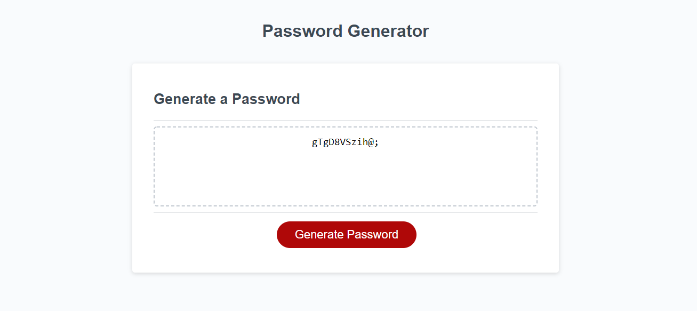

# Password Generator

[Click here for my deployed password generator!](https://cat-lin-morgan.github.io/password-generator/ "Password Generator")

The assignment was to write a function or rather functions to help finish the random password generator. 
Our task was to present the user with a series of prompts to clearly ask what the user would like for their totally random password. We asked the user if they would like lower case, upper case, numeric, or special charracters in their password as well as length of password. 
We then also had to make sure they corectly entered inputs. Making sure they entered anything at all and then making sure that if they didn't enter anything, that they were reprompted. Basically full proofing it as much as possible.

This assignment was tricky and involved knowledge and understanding of arrays, if/else statements, and for(and while) loops.
___ 

Screenshot of image and password properly returned!

**Thank you!**